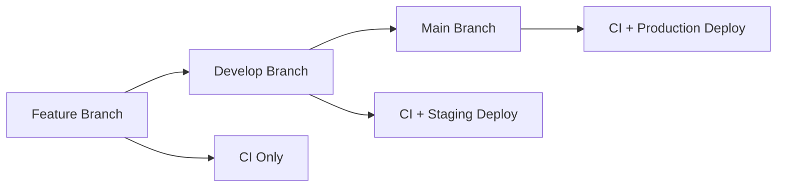

# 🎮 3D Gaming Website

<div align="center">
  
  
  
  
  
  
  
</div>

An immersive 3D gaming website built with React, Vite, GSAP, and Tailwind CSS. This project features stunning 3D animations, modern design, and a complete CI/CD pipeline with Docker and Kubernetes support.

## ✨ Features

- **🎨 Stunning 3D Animations**: Powered by GSAP for smooth, performance-optimized animations
- **⚡ Lightning Fast**: Built with Vite for optimal development experience and build performance
- **📱 Responsive Design**: Tailwind CSS for mobile-first, responsive layouts
- **🎵 Audio Integration**: Immersive sound effects and background music
- **🐳 Containerized**: Docker support for consistent development and deployment
- **☸️ Kubernetes Ready**: Complete K8s manifests for scalable deployment
- **🚀 CI/CD Pipeline**: GitHub Actions for automated testing, building, and deployment
- **🔧 Developer Friendly**: Comprehensive scripts and tools for easy development

## 🚀 Quick Start

### Prerequisites

- **Node.js** 18 or higher
- **npm** or **yarn**
- **Docker** (optional, for containerization)
- **kubectl** (optional, for Kubernetes deployment)
- **minikube** (optional, for local Kubernetes)

### 1. Setup Development Environment

```bash
# Clone the repository
git clone https://github.com/DharshanSR/3D-Gaming-Website.git
cd 3D-Gaming-Website

# Run the setup script
make setup
# or
./scripts/setup.sh
```

### 2. Start Development Server

```bash
# Start development server
make dev
# or
npm run dev

# Start with Docker (optional)
make dev-docker
```

Open [http://localhost:5173](http://localhost:5173) to view the application.

## 📋 Available Commands

### Using Make (Recommended)

```bash
make help                 # Show all available commands
make setup               # Setup development environment
make dev                 # Start development server
make build               # Build for production
make test                # Run tests and quality checks
make docker-build        # Build Docker image
make k8s-deploy          # Deploy to Kubernetes
make clean               # Clean build artifacts
```

### Using npm scripts

```bash
npm run dev              # Start development server
npm run build            # Build for production
npm run lint             # Run ESLint
npm run format           # Format code with Prettier
npm run docker:build     # Build Docker image
npm run k8s:deploy       # Deploy to Kubernetes
```

### Using Scripts Directly

```bash
./scripts/setup.sh       # Setup environment
./scripts/dev.sh         # Start development
./scripts/build.sh       # Build application
./scripts/test.sh        # Run quality checks
./scripts/deploy-local.sh # Deploy to local Kubernetes
```

## 🏗️ Development

### Project Structure

```
3D-Gaming-Website/
├── public/                 # Static assets
│   ├── audio/             # Audio files
│   ├── fonts/             # Custom fonts
│   ├── img/               # Images and graphics
│   └── videos/            # Video files
├── src/                   # Source code
│   ├── components/        # React components
│   ├── App.jsx           # Main application component
│   ├── main.jsx          # Application entry point
│   └── index.css         # Global styles
├── k8s/                   # Kubernetes manifests
├── scripts/               # Utility scripts
├── .github/workflows/     # GitHub Actions CI/CD
├── Dockerfile            # Production Docker image
├── docker-compose.yml    # Docker Compose configuration
└── Makefile              # Convenient commands
```

### Tech Stack

- **Frontend**: React 18, Vite, Tailwind CSS
- **Animations**: GSAP (GreenSock Animation Platform)
- **Icons**: React Icons
- **Utilities**: Clsx, React Use
- **Build Tool**: Vite
- **Linting**: ESLint
- **Formatting**: Prettier

### Development Workflow

1. **Start Development**: `make dev`
2. **Make Changes**: Edit files in `src/`
3. **Check Quality**: `make test`
4. **Build**: `make build`
5. **Deploy**: `make k8s-deploy`

## 🐳 Docker

### Build and Run Locally

```bash
# Build production image
make docker-build

# Run container
make docker-run

# Or use Docker Compose
make docker-compose-up
```

### Docker Images

- **Production**: Multi-stage build with Nginx
- **Development**: Node.js with hot reload
- **Size Optimized**: Alpine Linux base images

## ☸️ Kubernetes Deployment

### Local Development with Minikube

```bash
# Setup Minikube and deploy
make k8s-deploy

# Check deployment status
make k8s-status

# Access application
echo "127.0.0.1 gaming-website.local" | sudo tee -a /etc/hosts
open http://gaming-website.local
```

### Kubernetes Resources

- **Namespace**: Isolated environment
- **Deployment**: 3 replicas with rolling updates
- **Service**: ClusterIP for internal communication
- **Ingress**: External access with SSL support
- **HPA**: Auto-scaling based on CPU/memory
- **ConfigMap**: Nginx configuration

### Production Deployment

```bash
# Build and push to registry
docker build -t ghcr.io/dharshans/3d-gaming-website:latest .
docker push ghcr.io/dharshans/3d-gaming-website:latest

# Deploy to production cluster
kubectl apply -f k8s/
```

## 🚀 CI/CD Pipeline

### Separate Workflows for Better Organization

The project uses three distinct GitHub Actions workflows:

#### 1. **CI Pipeline** (`ci.yml`)
- **Triggers**: Push/PR to any branch
- **Purpose**: Code quality, testing, building, security scanning
- **Stages**:
  - Code quality checks (ESLint, Prettier, Security audit)
  - Unit tests and coverage
  - Production build
  - Docker image build and vulnerability scanning

#### 2. **CD Pipeline** (`cd.yml`)
- **Triggers**: Successful CI completion
- **Purpose**: Automated deployment
- **Stages**:
  - Staging deployment (from `develop` branch)
  - Production deployment (from `main` branch)
  - Health checks and verification
  - Automatic rollback on failure

#### 3. **Manual Deploy** (`manual-deploy.yml`)
- **Triggers**: Manual workflow dispatch
- **Purpose**: On-demand deployments
- **Features**:
  - Environment selection (staging/production)
  - Custom image tag deployment
  - Force deploy option
  - Manual approval for production

### Deployment Flow



### Secrets Configuration

Add these secrets to your GitHub repository:

```bash
GITHUB_TOKEN          # Automatically provided
KUBECONFIG           # Kubernetes configuration (if deploying to external cluster)
```

## 🔧 Configuration

### Environment Variables

Create `.env.local` for local development:

```bash
VITE_APP_TITLE=3D Gaming Website
VITE_APP_DESCRIPTION=An immersive 3D gaming experience
VITE_API_URL=http://localhost:3001
VITE_ENV=development
```

### Build Configuration

- **Vite**: `vite.config.js`
- **Tailwind**: `tailwind.config.js`
- **ESLint**: `eslint.config.js`
- **PostCSS**: `postcss.config.js`
- **Prettier**: `.prettierrc`

## 🎨 Customization

### Adding New Components

1. Create component in `src/components/`
2. Export from component file
3. Import in `App.jsx` or parent component

### Styling

- Use Tailwind classes for styling
- Custom fonts available in `public/fonts/`
- GSAP for animations

### Assets

- **Images**: Add to `public/img/`
- **Videos**: Add to `public/videos/`
- **Audio**: Add to `public/audio/`
- **Fonts**: Add to `public/fonts/`

## 🧪 Testing

### Quality Checks

```bash
make test               # Run all checks
./scripts/test.sh --lint     # ESLint only
./scripts/test.sh --format   # Prettier check
./scripts/test.sh --security # Security audit
```

### Manual Testing

1. **Development**: `make dev`
2. **Production Build**: `make build && make preview`
3. **Docker**: `make docker-build && make docker-run`
4. **Kubernetes**: `make k8s-deploy`

## 🚨 Troubleshooting

### Common Issues

**Port already in use**
```bash
# Kill process on port 5173
lsof -ti:5173 | xargs kill -9
```

**Docker build fails**
```bash
# Clean Docker cache
docker system prune -a
```

**Kubernetes deployment fails**
```bash
# Check pod logs
kubectl logs -f deployment/gaming-website-deployment -n gaming-website

# Check events
kubectl get events -n gaming-website --sort-by='.lastTimestamp'
```

**Permission denied on scripts**
```bash
# Make scripts executable
chmod +x scripts/*.sh
```

### Debug Commands

```bash
# Check application logs
kubectl logs -f deployment/gaming-website-deployment -n gaming-website

# Port forward for debugging
kubectl port-forward svc/gaming-website-service 8080:80 -n gaming-website

# Check resource usage
kubectl top pods -n gaming-website
```

## 🤝 Contributing

1. Fork the repository
2. Create a feature branch: `git checkout -b feature/amazing-feature`
3. Make your changes
4. Run quality checks: `make test`
5. Commit changes: `git commit -m 'Add amazing feature'`
6. Push to branch: `git push origin feature/amazing-feature`
7. Open a Pull Request

### Code Style

- Use Prettier for formatting
- Follow ESLint rules
- Write meaningful commit messages
- Add comments for complex logic

## 📜 License

This project is licensed under the MIT License - see the [LICENSE](LICENSE) file for details.

## 🙏 Acknowledgments

- **GSAP** for amazing animation capabilities
- **Vite** for fast development experience
- **Tailwind CSS** for utility-first styling
- **React** for component-based architecture

## 📞 Support

If you encounter any issues or have questions:

1. Check the [Troubleshooting](#-troubleshooting) section
2. Search existing [Issues](https://github.com/DharshanSR/3D-Gaming-Website/issues)
3. Create a new issue with detailed information

---

**Happy Coding! 🚀**
